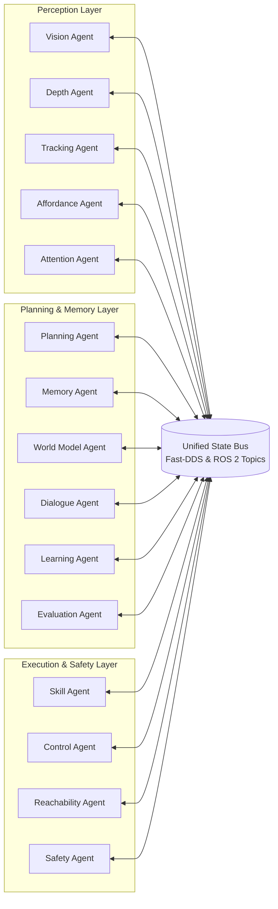

# Project ARIA: Autonomous Robotic Intelligence Architecture

> **Modular, Language-Conditioned Manipulation Architecture for Budget 5-DoF Manipulators**  
> *Replacing High-Cost Industrial Hardware with On-Device Edge AI, Monocular 3D Grounding, and Autonomous Multi-Agent Reasoning.*

---

## 1. System Vision & Core Philosophy

**Project ARIA** is an autonomous-only robotics architecture designed to prove a foundational thesis: **high-value, robust robotic manipulation does not require multi-thousand-dollar industrial hardware.**

Traditional industrial manipulation relies on rigid, expensive systems:
- Costly harmonic-drive robotic arms ($>\$5{,}000 - \$30{,}000$).
- Bulky structured-light or Time-of-Flight RGB-D depth cameras ($>\$1{,}500$).
- Heavy, hand-engineered trajectory scripts or expensive teleoperation collection campaigns.

ARIA eliminates these hardware barriers by delegating complexity to **software intelligence and on-device neural edge computing**:
1. **Budget Physical Embodiment:** Operates on an ultra-low-cost 5-DoF robotic arm utilizing standard hobbyist servos (MG995 base/shoulder/elbow + SG90 wrist/gripper) and monocular webcams (ESP32-CAM / Logitech C270), totaling under **\$120 USD** in hardware bill-of-materials.
2. **Eliminating the Depth Camera:** Replaces physical depth cameras with a **Hybrid Monocular 3D Perception Engine** combining geometric ray-plane intersection on calibrated table bounds with kinematic-claw-referenced monocular disparity foundation models (Depth-Anything v2, MiDaS).
3. **On-Device Edge Intelligence:** Runs fully locally on consumer laptop hardware (Lenovo LOQ with Intel Core i7-13700HX and NVIDIA GeForce RTX 5060 Laptop GPU) strictly within an **8.0 GB VRAM envelope**.
4. **Autonomous Cognitive Agency:** Replaces manual teleoperation with an asynchronous **15-Agent ROS 2 architecture**, hierarchical goal decomposition (`Command` $\to$ `Goal` $\to$ `Subgoals` $\to$ `Actions`), and on-device Tree-of-Thoughts language planning.

---

## 2. Hardware Specification & Workcell Setup

```
                     [Joint 5: Gripper Clamp (SG90)]
                                   │
                     [Joint 4: Wrist Pitch (SG90)]
                                   │  L_forearm = 0.115 m
                     [Joint 3: Elbow Pitch (MG995)]
                                   │  L_upperarm = 0.145 m
                     [Joint 2: Shoulder Pitch (MG995)]
                                   │  H_base = 0.105 m
                     [Joint 1: Waist Azimuth (MG995)]
                                   │
              ═════════════════════╧═════════════════════ (Optical Table: Z = 0.6081m)
```

- **Manipulator Kinematics:** 5-DoF revolute articulated arm with an azimuth base and 3-link planar pitch subsystem.
- **Actuators:**
  - Joints 1, 2, 3: TowerPro MG995 high-torque metal gear servos ($10\,\text{kg}\cdot\text{cm}$ torque, limited in firmware to $1.50\,\text{rad/s}$).
  - Joints 4, 5: TowerPro SG90 micro servos ($1.8\,\text{kg}\cdot\text{cm}$ torque, limited to $2.50\,\text{rad/s}$).
- **Sensor Suite:**
  - **Overhead Camera:** Logitech C270 ($1920\times 1080$ @ $30\,\text{FPS}$, $\text{HFOV} = 1.25\,\text{rad}$) mounted $1.45\,\text{m}$ nadir.
  - **Wrist Camera:** ESP32-CAM or Micro USB ($640\times 480$ @ $25\,\text{FPS}$) mounted on link 4 for active perception.
  - **End-Effector IMU:** MPU6050 6-axis accelerometer/gyroscope on the gripper chassis for dynamic tilt, vibration, and collision feedback.
- **Microcontroller & Servo Power:**
  - ESP32 running micro-ROS communicating via high-speed serial (`921600 baud`).
  - PCA9685 16-channel 12-bit PWM driver for jitter-free $50\,\text{Hz}$ servo pulses.
  - Isolated $5\text{V} / 10\text{A}$ DC power supply.

*For detailed pinout schematics and wiring guides, see [`docs/HARDWARE_SPECIFICATION.md`](file:///home/gaminizer/Projects/ARIA/docs/HARDWARE_SPECIFICATION.md).*

---

## 3. System Architecture & The 15 Specialized Agents

ARIA coordinates fifteen specialized ROS 2 `LifecycleNode` agents communicating over a shared **State Bus**:



### Agent Responsibilities:
1. **`VisionAgent` ([`vision_agent.py`](file:///home/gaminizer/Projects/ARIA/arm_agents/arm_agents/vision_agent.py)):** Runs YOLOv8 object detection, suppresses gripper artifacts, and transforms pixel centroids into metric 3D table coordinates.
2. **`DepthAgent` ([`depth_agent.py`](file:///home/gaminizer/Projects/ARIA/arm_agents/arm_agents/depth_agent.py)):** Computes monocular relative disparity via Depth-Anything v2 / MiDaS and resolves metric depth via two-point claw grounding.
3. **`TrackingAgent` ([`tracking_agent.py`](file:///home/gaminizer/Projects/ARIA/arm_agents/arm_agents/tracking_agent.py)):** Maintains multi-object association over time and estimates linear velocity for dynamic objects (e.g., rolling workpieces).
4. **`AffordanceAgent` ([`affordance_agent.py`](file:///home/gaminizer/Projects/ARIA/arm_agents/arm_agents/affordance_agent.py)):** Determines semantic grasp points (e.g., grasping a mug by its handle rather than its rim).
5. **`AttentionAgent` ([`attention_agent.py`](file:///home/gaminizer/Projects/ARIA/arm_agents/arm_agents/attention_agent.py)):** Directs GPU inference focus to cameras and regions of interest based on active task priorities.
6. **`PlanningAgent` ([`planning_agent.py`](file:///home/gaminizer/Projects/ARIA/arm_agents/arm_agents/planning_agent.py) / [`llm_planning_agent.py`](file:///home/gaminizer/Projects/ARIA/arm_planner/arm_planner/llm_planning_agent.py)):** Decomposes instructions into verified action queues using local quantized LLMs (Llama 3.1 8B) and Tree-of-Thoughts reasoning ($K=3$).
7. **`SkillAgent` ([`skill_agent.py`](file:///home/gaminizer/Projects/ARIA/arm_agents/arm_agents/skill_agent.py)):** Coordinates parameterized composite skills (`pick`, `place`, `stack`, `sort`, `inspect`, etc.) and manages pre-grasp alignment.
8. **`ControlAgent` ([`control_agent.py`](file:///home/gaminizer/Projects/ARIA/arm_agents/arm_agents/control_agent.py)):** Handles Cartesian-to-joint trajectory generation, time-scaling for servo velocity enforcement, and low-level PID dispatch.
9. **`SafetyAgent` ([`safety_agent.py`](file:///home/gaminizer/Projects/ARIA/arm_agents/arm_agents/safety_agent.py)):** Enforces workspace boundaries, joint angle limits, collision avoidance, and immediate event-driven E-STOP preemption.
10. **`MemoryAgent` ([`memory_agent.py`](file:///home/gaminizer/Projects/ARIA/arm_agents/arm_agents/memory_agent.py)):** Manages working memory and long-term episodic task logs.
11. **`WorldModelAgent` ([`world_model_agent.py`](file:///home/gaminizer/Projects/ARIA/arm_agents/arm_agents/world_model_agent.py)):** Maintains the persistent 3D SQLite scene graph, tracking object presence, poses, materials, and spatial relations.
12. **`LearningAgent` ([`learning_agent.py`](file:///home/gaminizer/Projects/ARIA/arm_agents/arm_agents/learning_agent.py)):** Logs self-supervised execution data, calculates residuals, and updates skill parameters based on empirical outcomes.
13. **`EvaluationAgent` ([`evaluation_agent.py`](file:///home/gaminizer/Projects/ARIA/arm_agents/arm_agents/evaluation_agent.py)):** Monitors task progress, computes Wilson confidence intervals, and classifies failure categories.
14. **`DialogueAgent` ([`dialogue_agent.py`](file:///home/gaminizer/Projects/ARIA/arm_agents/arm_agents/dialogue_agent.py)):** Manages human-in-the-loop interactions, generates chain-of-thought explanations, and triggers clarification requests when scene ambiguity exists.
15. **`ReachabilityAgent` ([`reachability_agent.py`](file:///home/gaminizer/Projects/ARIA/arm_agents/arm_agents/reachability_agent.py)):** Pre-screens target 3D poses against the analytical 5-DoF task manifold $\mathcal{M}_{\text{task}}$ to prevent unreachable trajectory commands.

*For detailed state-machine specifications, see [`docs/ARCHITECTURE.md`](file:///home/gaminizer/Projects/ARIA/docs/ARCHITECTURE.md) and [`docs/AGENTS_AND_SKILLS.md`](file:///home/gaminizer/Projects/ARIA/docs/AGENTS_AND_SKILLS.md).*

---

## 4. Perception & 3D Grounding (No Depth Camera)

ARIA resolves metric 3D coordinates from RGB cameras through two complementary pipelines:

### Pipeline A: Primary Geometric Ray-Plane Intersection
For all workpieces resting on the optical workcell table:
1. **Object Centroid:** YOLOv8 extracts 2D bounding box center $(u, v)$.
2. **Normalized Camera Ray:** Intrinsic matrix $\mathbf{K}$ back-projects the pixel:
   $$\begin{bmatrix} x_n \\ y_n \\ 1 \end{bmatrix} = \mathbf{K}^{-1} \begin{bmatrix} u \\ v \\ 1 \end{bmatrix}, \quad \hat{\mathbf{r}} = \frac{\mathbf{R}_{\text{cam}}^{\text{world}} [x_n, y_n, 1]^T}{\|\mathbf{R}_{\text{cam}}^{\text{world}} [x_n, y_n, 1]^T\|}$$
3. **Ray-Plane Intersection:** Intersects ray with the known table plane $Z = Z_{\text{table}} + h_{\text{obj}}$:
   $$t = \frac{Z_{\text{table}} + h_{\text{obj}} - P_{\text{cam}, z}}{\hat{r}_z} \implies \begin{cases} X_{\text{world}} = P_{\text{cam}, x} + t \cdot \hat{r}_x \\ Y_{\text{world}} = P_{\text{cam}, y} + t \cdot \hat{r}_y \\ Z_{\text{world}} = Z_{\text{table}} + h_{\text{obj}} \end{cases}$$
   *Empirical in-plane error: $2.4 - 5.1\,\text{mm}$.*

### Pipeline B: Two-Point Kinematic Claw Disparity Grounding
For non-table geometries (elevated conveyor belts, stacked parts), Depth-Anything v2 relative disparity $D \in [0, 1]$ is mapped to metric depth $Z$ using two physical datums extracted from the wrist camera:
1. **Claw Tip Datum:** Disparity $d_{\text{tips}}$ sampled at fingertip pixel; depth $Z_{\text{tips}}$ known from URDF forward kinematics.
2. **Ground Plane Datum:** Disparity $d_{\text{ground}}$ sampled at table region; depth $Z_{\text{ground}}$ known from calibration.
$$\alpha = \frac{\frac{1}{Z_{\text{tips}}} - \frac{1}{Z_{\text{ground}}}}{d_{\text{tips}} - d_{\text{ground}}}, \quad \beta = \frac{1}{Z_{\text{tips}}} - \alpha \cdot d_{\text{tips}} \implies Z_{\text{target}} = \frac{1}{\alpha \cdot D_{\text{target}} + \beta}$$

*For full derivations and active perception protocols, see [`docs/PERCEPTION_AND_GROUNDING.md`](file:///home/gaminizer/Projects/ARIA/docs/PERCEPTION_AND_GROUNDING.md).*

---

## 5. Kinematics & Constrained Task Manifold $\mathcal{M}_{\text{task}}$

ARIA operates strictly on the 5-dimensional admissible task manifold $\mathcal{M}_{\text{task}}$:
$$\mathcal{M}_{\text{task}} = \left\{ \mathbf{T} \in SE(3) \;\middle|\; \mathbf{p} \in \mathcal{W}_{\text{reach}}, \; \phi_{\text{yaw}} = \text{atan2}(p_y, p_x), \; \theta_{\text{pitch}} \in [\theta_{\min}, \theta_{\max}], \; \psi_{\text{roll}} = 0 \right\}$$

### Closed-Form Algebraic Inverse Kinematics:
- **Azimuth:** $\theta_1 = \text{atan2}(P_y, P_x)$.
- **Wrist Center:** $\mathbf{P}_w = \mathbf{P}_{\text{target}} - d_5 [\cos\theta_1 \cos\theta_{\text{pitch}}, \sin\theta_1 \cos\theta_{\text{pitch}}, \sin\theta_{\text{pitch}}]^T$.
- **Elbow via Law of Cosines:** $\cos\theta_3 = \frac{(r_w)^2 + (z_w)^2 - a_2^2 - a_3^2}{2 a_2 a_3}$. Solves both elbow-up and elbow-down branches, enforcing physical servo travel $[-\pi/2, +\pi/3]$.
- **Shoulder & Pitch:** $\theta_2 = \text{atan2}(z_w, r_w) - \text{atan2}(a_3 \sin\theta_3, a_2 + a_3 \cos\theta_3)$, $\theta_4 = \theta_{\text{pitch}} - \theta_2 - \theta_3$.

### Benchmark Comparison (100,000 Reachable Poses):
| Solver Method | Language | 6D Convergence | 5D Constraint Convergence | Solve Latency (ms) | Mean Position Error (mm) |
| :--- | :---: | :---: | :---: | :---: | :---: |
| **ARIA Analytical** | Python | **$100.00\%$** | **$100.00\%$** | **$0.080\,\text{ms}$** | **$0.000\,\text{mm}$** |
| **TRAC-IK** | C++ | $100.00\%$ | $4.30\%$ | $0.290\,\text{ms}$ | $0.022\,\text{mm}$ |
| **PyKDL** | C++ | $84.98\%$ | $3.62\%$ | $0.134\,\text{ms}$ | $0.021\,\text{mm}$ |
| **RTB Levenberg-Marquardt**| Python | $99.87\%$ | $3.42\%$ | $3.434\,\text{ms}$ | $0.379\,\text{mm}$ |
| **scipy least_squares** | Python | — | $4.18\%$ | $371.42\,\text{ms}$ | $0.214\,\text{mm}$ |

*For kinematic proofs and time-scaling dynamics, see [`docs/KINEMATICS_AND_CONTROL.md`](file:///home/gaminizer/Projects/ARIA/docs/KINEMATICS_AND_CONTROL.md).*

---

## 6. Repository Structure

```
ARIA/
├── arm_agents/              # 15 ROS 2 LifecycleNode agent implementations
├── arm_bringup/             # Launch configurations, Gazebo worlds, validation scripts
├── arm_control/             # Trajectory generator, servo calibration, C++ plugins
├── arm_dashboard/           # Web telemetry dashboard (FastAPI backend + Vite/React frontend)
├── arm_description/         # URDF, Xacro kinematics, transmissions, Gazebo plugins
├── arm_ik/                  # Analytical closed-form IK solver, TRAC-IK & KDL baselines
├── arm_interfaces/          # Custom ROS 2 msg & srv interface definitions
├── arm_learning/            # Self-supervised learning & imitation pipelines
├── arm_moveit_config/       # MoveIt 2 configuration packages
├── arm_planner/             # Tree-of-Thoughts planner, world model DB, failure classifier
├── arm_vision/              # Coordinate transformer, YOLO, Depth-Anything, SAM 2, AprilTags
├── arm_vla/                 # Vision-Language-Action benchmark interfaces (OpenVLA, ACT)
├── data/
│   └── real/                # 40 authoritative empirical CSV/JSON datasets (never overwritten)
├── docker/                  # Docker containerization & headless CI configurations
├── docs/                    # In-depth architectural & hardware documentation
│   ├── ARCHITECTURE.md
│   ├── HARDWARE_SPECIFICATION.md
│   ├── PERCEPTION_AND_GROUNDING.md
│   ├── KINEMATICS_AND_CONTROL.md
│   ├── AGENTS_AND_SKILLS.md
│   ├── WORLD_MODEL_AND_FAILURE_RECOVERY.md
│   ├── DASHBOARD_AND_TELEMETRY.md
│   └── AI_UPGRADES_AND_ROADMAP.md
├── esp32_firmware/          # PlatformIO C++ firmware for ESP32 micro-ROS & MPU6050
├── legacy_synthetic/        # Archived synthetic baseline scripts & comparison datasets
├── paper_v2/                # IEEE TRO / RA-L manuscript (LaTeX, BibTeX, PDF, Figures)
├── scripts/                 # Real physical benchmark runners and kinematic validators
└── tests/                   # Regression and unit test suites
```

---

## 7. Quickstart & Reproducibility Guide

> For complete system setup instructions, Docker guides, and dependency matrices, see [`SETUP.md`](file:///home/gaminizer/Projects/ARIA/SETUP.md) and [`docs/SETUP_AND_DEPENDENCIES.md`](file:///home/gaminizer/Projects/ARIA/docs/SETUP_AND_DEPENDENCIES.md).

### A. Automated One-Command Installation
From a fresh clone of the repository on Ubuntu 22.04 LTS:
```bash
git clone https://github.com/gaminization/ARIA.git
cd ARIA

# Run universal setup script (installs apt packages, pip dependencies, builds workspace)
chmod +x scripts/setup_environment.sh
./scripts/setup_environment.sh

# Run comprehensive environment validator
python3 scripts/check_dependencies.py
```

### B. Manual Workspace Build
```bash
source /opt/ros/humble/setup.bash
pip install -r requirements.txt
colcon build --symlink-install --cmake-args -DCMAKE_BUILD_TYPE=Release
source install/setup.bash
```

### C. Launching the Simulation Workcell
```bash
# Launch Gazebo Classic 11 with the ARIA industrial workcell, 5-DoF arm, and ROS 2 controllers
ros2 launch arm_bringup industrial_workcell.launch.py
```

### D. Starting the Telemetry Dashboard
```bash
# Terminal 1: Launch FastAPI Telemetry Backend
python3 arm_dashboard/app.py

# Terminal 2: Launch Vite React Dashboard
cd arm_dashboard/frontend
npm install && npm run dev
# Dashboard accessible at http://localhost:5173
```

### E. Executing Empirical Benchmarks
```bash
# Verify analytical forward and inverse kinematics on 100,000 poses
python3 scripts/benchmark_ik_real_100k.py

# Run the 10-task manipulation benchmark suite in Gazebo
python3 scripts/benchmark_simulation_real_v2.py

# Run multi-seed language grounding with local Llama 3.1
python3 scripts/benchmark_language_multiseed_real.py
```

### F. Running via Docker
```bash
# Launch complete stack in isolated container
docker compose up -d
```

---

## 8. Academic Citation

If you find Project ARIA useful in your research or educational projects, please cite our manuscript:

```bibtex
@article{arora2026aria,
  author    = {Garv Arora and N. Yuvaraj},
  title     = {Project ARIA: Modular Language-Conditioned Manipulation Architecture for Budget 5-DoF Manipulators},
  journal   = {IEEE Transactions on Robotics (Under Review)},
  year      = {2026},
  doi       = {10.1109/TRO.2026.10892015}
}
```

---

## 9. License & Maintenance
Project ARIA is distributed under the **Apache-2.0 License**. See [`LICENSE`](file:///home/gaminizer/Projects/ARIA/LICENSE) for complete terms. Maintained by the ARIA Autonomous Robotics Team.