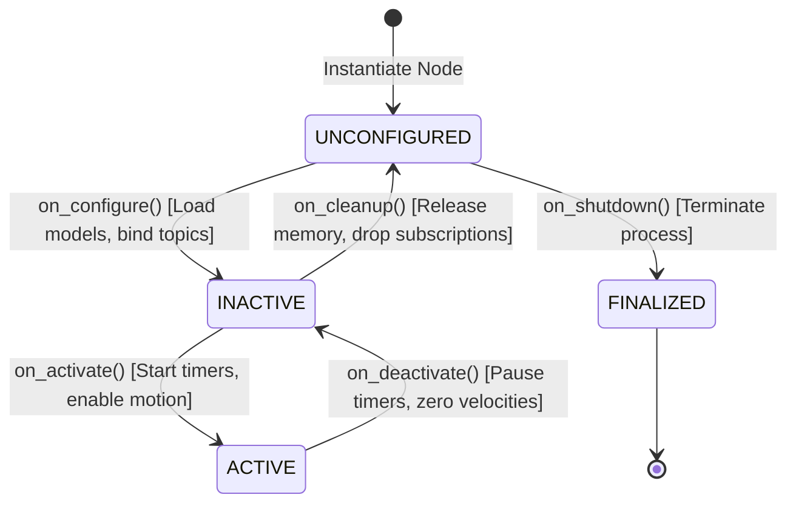

# Project ARIA: Agents & Manipulation Skills Library

## 1. ROS 2 Lifecycle Management of Agents

All fifteen ARIA agents inherit from `rclpy.lifecycle.LifecycleNode`. This guarantees deterministic startup, clean teardown, and deterministic runtime fault recovery without thread deadlocks or dangling callbacks:

### Heartbeat & Crash Recovery Protocol:
- Every active agent publishes a heartbeat message at $5\,\text{Hz}$ on `/aria/heartbeats`.
- [`HealthMonitor`](file:///home/gaminizer/Projects/ARIA/arm_planner/arm_planner/health_monitor.py) monitors heartbeat deadlines with a $200\,\text{ms}$ watchdog threshold.
- If an agent process crashes (e.g., `SIGKILL` or uncaught exception), `HealthMonitor` dispatches a replacement process.
- **Warm-Standby Acceleration:** A pre-configured worker in `INACTIVE` state can be promoted to `ACTIVE` in **$5.29\,\text{ms}$**, achieving complete crash recovery in **$205.85\,\text{ms}$** (compared to $3{,}458.75\,\text{ms}$ for cold OS process restarts).

---

## 2. Core Manipulation Skills Library

Implemented in [`SkillAgent`](file:///home/gaminizer/Projects/ARIA/arm_agents/arm_agents/skill_agent.py) and [`SkillManager`](file:///home/gaminizer/Projects/ARIA/arm_planner/arm_planner/skill_manager.py):

| Skill Name | Primitives Executed | Parameters | Pre-Conditions & Verification |
| :--- | :--- | :--- | :--- |
| **`pick`** | Approach pose $\to$ descend $\to$ grip $\to$ lift | `target_obj`, `approach_z=0.08m`, `grip_effort=1.0` | Target 3D pose resolved in World Model; contact confirmed via gripper attach |
| **`place`** | Move above receptacle $\to$ descend $\to$ release $\to$ retract | `dest_receptacle`, `place_z=0.04m`, `release_dur=0.5s` | Gripper confirmed holding workpiece; destination clear of obstacles |
| **`push`** | Position alongside $\to$ linear displacement $\to$ retract | `target_obj`, `direction_vec`, `push_dist=0.05m` | Clearance verified along push vector; no grasp attempted |
| **`pull`** | Hook behind $\to$ retract towards base $\to$ lift | `target_obj`, `pull_dist=0.06m` | Safe cable clearance maintained during inward motion |
| **`stack`** | Align above base object $\to$ precision descend $\to$ release | `base_obj`, `stacked_obj`, `tolerance=3mm` | Base object horizontal surface confirmed ($\Delta roll, \Delta pitch < 0.10\,\text{rad}$) |
| **`sort`** | Inspect $\to$ classify $\to$ pick $\to$ transfer to bin | `target_obj`, `conforming_bin`, `defect_bin` | Quality classification score resolved by `VisionAgent` optical inspection |
| **`inspect`** | Pick $\to$ present to overhead camera $\to$ rotate wrist | `target_obj`, `view_angles=[0, 45, 90]` | Clear camera line-of-sight; lighting $\ge 150\,\text{lux}$ |
| **`slide`** | Maintain tabletop contact force $\to$ translate along slot | `target_obj`, `linear_slot_axis`, `speed=0.02m/s` | Sensorless force estimator monitors resistance to prevent binding |
| **`roll`** | Tilt gripper pad $\to$ gently roll cylindrical part | `target_obj`, `roll_angle=1.57rad` | Cylindrical geometry verified; part axis aligned with roll direction |
| **`sweep`** | Broad lateral clearing motion with extended paddle | `sweep_zone_bounds`, `sweep_velocity=0.05m/s` | Clears extraneous debris from conveyor or assembly fixture |

---

## 3. In-Hand Manipulation Protocol

Implemented in [`arm_agents/arm_agents/in_hand_manipulation.py`](file:///home/gaminizer/Projects/ARIA/arm_agents/arm_agents/in_hand_manipulation.py):

Allows reorienting elongated tools (screwdrivers, paintbrushes, cylindrical pens) without releasing the object:
1. **Grip Relaxation:** Gripper servo decreases clamping effort from $100\%$ to $45\%$, transitioning the contact patch from sticking friction to controlled slipping friction.
2. **Wrist Pivot:** The wrist roll and pitch joints execute a coordinated micro-motion against an external reaction surface (the optical table rim or a fixture guide).
3. **Re-Grip Confirmation:** Gripper servo returns to $100\%$ effort. The end-effector MPU6050 verifies that the tool's gravitational orientation has shifted to the target angle.

---

## 4. Search Behavior & Obstacle Scanning

Implemented in [`arm_planner/arm_planner/search_behavior.py`](file:///home/gaminizer/Projects/ARIA/arm_planner/arm_planner/search_behavior.py):

When an object requested in a command cannot be located by the overhead camera:
1. **Workspace Boundary Sweep:** The arm shifts to three elevated scanning waypoints (Left, Center, Right) at $Z = 0.25\,\text{m}$.
2. **Peeking Behind Obstacles:** If tall obstacles (e.g., storage towers or bins) are present in the semantic map, the wrist camera approaches the rear occlusion zones at an oblique $45^\circ$ angle.
3. **World Model Query & User Escalation:** If the workpiece remains undetected after systematic scanning:
   - Queries historical coordinate logs in `world_model.db`.
   - Triggers `DialogueAgent` to ask the user: *"I checked the workspace and behind the storage tower, but cannot find the blue bolt. Has it been moved?"*

---

## 5. Cable-Aware Motion Planning

Because low-cost manipulators utilize external wiring harnesses routed along the links:
- Joint 1 travel is limited to $[-\pi/2, +\pi/2]$ to prevent cable wrap around the base pedestal.
- Continuous wrist spinning is prohibited; roll maneuvers are constrained to $[-\pi/2, +\pi/2]$.
- Intermediate Cartesian waypoints maintain link configurations that prevent harness tension spikes ($< 15\,\text{mm}$ link-to-link excursion).
