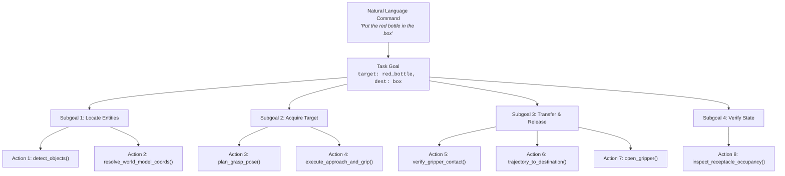
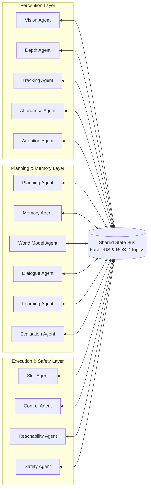

# Project ARIA: Autonomous System Architecture

## 1. Architectural Philosophy: The Autonomous Edge Manipulator

Project ARIA (**A**utonomous **R**obotic **I**ntelligence **A**rchitecture) is designed around a singular paradigm: **high-value robotic manipulation achieved through embedded AI systems on ultra-low-cost physical hardware.**

Traditional industrial manipulation relies on expensive hardware components:
- High-precision harmonic drives and industrial optical encoders ($>\$5{,}000$).
- Structured-light or Time-of-Flight (ToF) industrial RGB-D cameras ($>\$1{,}500$).
- Rigid, dedicated workcells with fixed part feeders and PLC safety barriers.

ARIA eliminates these expensive hardware dependencies by delegating complexity to **software intelligence and on-device neural edge computing**:
1. **Hardware Replacement via Edge AI:** Operates with budget hobbyist servo actuators (MG995 base/shoulder/elbow + SG90 wrist/gripper) and inexpensive monocular camera sensors (ESP32-CAM / Logitech C270) within an 8.0 GB VRAM compute envelope (e.g., NVIDIA GeForce RTX 5060 Laptop GPU paired with Intel Core i7-13700HX).
2. **Monocular 3D Metric Perception:** Bypasses dedicated depth cameras by combining monocular relative disparity foundation models (Depth-Anything v2, MiDaS) with calibrated geometric ray-plane intersection and kinematic claw referencing.
3. **Autonomous Agency over Blind Teleoperation:** Replaces expensive human demonstrations and rigid script playback with autonomous multi-agent reasoning, self-supervised parameter logging, and self-healing fault recovery.

---

## 2. Hierarchical Goal Decomposition

ARIA decomposes high-level natural language instructions into deterministically verifiable physical actions through a four-tier hierarchical execution pyramid:



### Hierarchy Breakdown:
1. **Command:** The user's unstructured verbal or textual intent (e.g., *"ARIA, clean the workstation by sorting conforming bolts into the tray and defects into the bin"*).
2. **Goal:** The structured symbolic intent extracted by [`PlanningAgent`](file:///home/gaminizer/Projects/ARIA/arm_agents/arm_agents/planning_agent.py), parsed into primary targets, destination containers, and execution constraints.
3. **Subgoals:** Sequential pre-condition and post-condition milestones managed by [`TaskManager`](file:///home/gaminizer/Projects/ARIA/arm_planner/arm_planner/task_manager.py) and [`SkillManager`](file:///home/gaminizer/Projects/ARIA/arm_planner/arm_planner/skill_manager.py).
4. **Actions:** Atomic, parameter-bounded primitives dispatched to the hardware controllers: `pick`, `place`, `push`, `pull`, `stack`, `sort`, `inspect`, `slide`, `roll`, `sweep`.

---

## 3. Asynchronous Multi-Agent Node Architecture

ARIA comprises fifteen specialized ROS 2 `LifecycleNode` agents coordinated across an asynchronous shared **State Bus**. Nodes maintain strict deterministic finite state machines (`UNCONFIGURED` $\to$ `INACTIVE` $\to$ `ACTIVE` $\to$ `FINALIZED`):



### Fifteen Agent Responsibilities:
1. **`VisionAgent` ([`vision_agent.py`](file:///home/gaminizer/Projects/ARIA/arm_agents/arm_agents/vision_agent.py)):** Ingests raw camera frames (overhead and wrist), executes YOLOv8 object detection, suppresses gripper artifacts, and converts pixel centroids to metric table coordinates.
2. **`DepthAgent` ([`depth_agent.py`](file:///home/gaminizer/Projects/ARIA/arm_agents/arm_agents/depth_agent.py)):** Runs monocular depth estimation (Depth-Anything v2 / MiDaS) and applies kinematic-claw two-point calibration to produce metric disparity groundings.
3. **`TrackingAgent` ([`tracking_agent.py`](file:///home/gaminizer/Projects/ARIA/arm_agents/arm_agents/tracking_agent.py)):** Maintains multi-object association over time, updates tracking IDs, and estimates linear velocity for dynamic objects (e.g., rolling workpieces).
4. **`AffordanceAgent` ([`affordance_agent.py`](file:///home/gaminizer/Projects/ARIA/arm_agents/arm_agents/affordance_agent.py)):** Analyzes object semantics to determine task-appropriate grasp geometries (e.g., grasping a mug by its handle rather than its rim).
5. **`AttentionAgent` ([`attention_agent.py`](file:///home/gaminizer/Projects/ARIA/arm_agents/arm_agents/attention_agent.py)):** Dynamically allocates GPU inference resources to cameras and regions of interest based on active task priorities.
6. **`PlanningAgent` ([`planning_agent.py`](file:///home/gaminizer/Projects/ARIA/arm_agents/arm_agents/planning_agent.py) / [`llm_planning_agent.py`](file:///home/gaminizer/Projects/ARIA/arm_planner/arm_planner/llm_planning_agent.py)):** Decomposes natural language into structured plans using local quantized LLMs (Llama 3.1 8B via Ollama) and Tree-of-Thoughts reasoning ($K=3$).
7. **`SkillAgent` ([`skill_agent.py`](file:///home/gaminizer/Projects/ARIA/arm_agents/arm_agents/skill_agent.py)):** Coordinates parameterized composite skills (`pick`, `place`, `stack`, `sort`, `inspect`, etc.) and manages pre-grasp alignment.
8. **`ControlAgent` ([`control_agent.py`](file:///home/gaminizer/Projects/ARIA/arm_agents/arm_agents/control_agent.py)):** Handles Cartesian-to-joint trajectory generation, time-scaling for servo velocity enforcement, and low-level PID dispatch.
9. **`SafetyAgent` ([`safety_agent.py`](file:///home/gaminizer/Projects/ARIA/arm_agents/arm_agents/safety_agent.py)):** Enforces workspace boundaries, joint angle limits, collision avoidance, and immediate event-driven E-STOP preemption.
10. **`MemoryAgent` ([`memory_agent.py`](file:///home/gaminizer/Projects/ARIA/arm_agents/arm_agents/memory_agent.py)):** Manages short-term working memory and long-term episodic task logs.
11. **`WorldModelAgent` ([`world_model_agent.py`](file:///home/gaminizer/Projects/ARIA/arm_agents/arm_agents/world_model_agent.py)):** Maintains the persistent 3D SQLite scene graph, tracking object presence, poses, materials, and spatial relations.
12. **`LearningAgent` ([`learning_agent.py`](file:///home/gaminizer/Projects/ARIA/arm_agents/arm_agents/learning_agent.py)):** Logs self-supervised execution data, calculates residuals, and updates skill parameters based on empirical outcomes.
13. **`EvaluationAgent` ([`evaluation_agent.py`](file:///home/gaminizer/Projects/ARIA/arm_agents/arm_agents/evaluation_agent.py)):** Monitors task progress, computes Wilson confidence intervals, and classifies failure categories.
14. **`DialogueAgent` ([`dialogue_agent.py`](file:///home/gaminizer/Projects/ARIA/arm_agents/arm_agents/dialogue_agent.py)):** Manages human-in-the-loop interactions, generates chain-of-thought explanations, and triggers clarification requests when scene ambiguity exists.
15. **`ReachabilityAgent` ([`reachability_agent.py`](file:///home/gaminizer/Projects/ARIA/arm_agents/arm_agents/reachability_agent.py)):** Pre-screens target 3D poses against the analytical 5-DoF task manifold $\mathcal{M}_{\text{task}}$ to prevent unreachable trajectory commands.

---

## 4. Unified State Bus Architecture

Communication between modules is centralized via ROS 2 topics mapped to five standardized core state messages:

```
┌────────────────────────────────────────────────────────────────────────┐
│                        ARIA UNIFIED STATE BUS                          │
├────────────────────────────────────────────────────────────────────────┤
│ 1. VisionState   : Detected objects, 3D poses, bounding boxes, labels  │
│ 2. MemoryState   : Persistent known entities, locations, timestamps   │
│ 3. JointState    : Raw & filtered angles, velocities, servo telemetry │
│ 4. TaskState     : Active goal, queued subgoals, chain-of-thought log  │
│ 5. HealthState   : Servo temperatures, drift, camera FPS, latencies   │
└────────────────────────────────────────────────────────────────────────┘
```

- **Topic Mapping:**
  - `/aria/state/vision` $\to$ `arm_planner/msg/VisionState`
  - `/aria/state/memory` $\to$ `arm_planner/msg/MemoryState`
  - `/joint_states` $\to$ `sensor_msgs/msg/JointState`
  - `/aria/state/task` $\to$ `arm_planner/msg/TaskState`
  - `/aria/state/health` $\to$ `arm_planner/msg/HealthState`

---

## 5. Failure Classification & Recovery Engine

Failures during execution are deterministically categorized by [`FailureClassifier`](file:///home/gaminizer/Projects/ARIA/arm_planner/arm_planner/failure_classifier.py) to trigger autonomous recovery protocols:

| Failure Code | Category Name | Sensor Trigger / Detection Signal | Automated Recovery Strategy |
| :--- | :--- | :--- | :--- |
| `A_VISUAL_OCCLUSION` | Perception Occlusion | Target object lost or detection confidence $< 0.40$ | Active perception: move wrist camera to alternate viewpoints |
| `B_GRASP_SLIP` | Grasp Contact Slip | Gripper closed with zero contact force / workpiece dropped | Re-open gripper, re-approach with increased pinch depth |
| `C_IK_FAILURE` | Kinematic Manifold Bound| Target Cartesian pose violates joint limits on $\mathcal{M}_{\text{task}}$ | Re-evaluate approach pitch angle $\theta_{\text{pitch}}$ or trigger push/slide |
| `D_TRACKING_LIMIT` | Joint Velocity Saturation | Commanded trajectory forces Joint 2 velocity $> 1.50\,\text{rad/s}$ | Time-scale trajectory duration: $t_{\text{new}} = t_{\text{curr}} \times (\dot{q} / 1.5)$ |
| `E_SAFETY_ESTOP` | Emergency Preemption | E-STOP event received or collision predicted | Immediate zero-velocity hold; wait for release service call |
