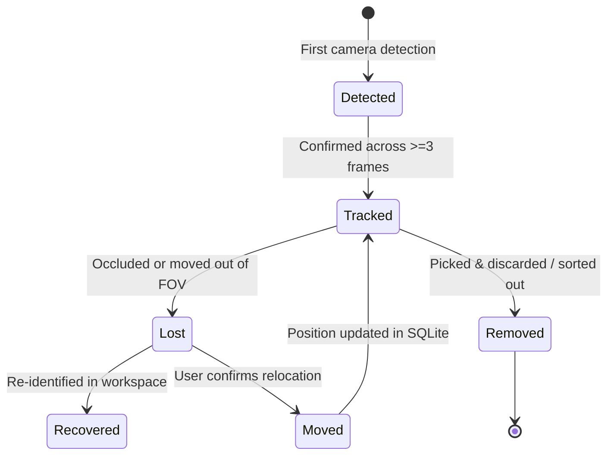

# Project ARIA: World Model, Failure Recovery & Health Monitoring

## 1. Persistent 3D World Model & Object Lifecycle

Project ARIA maintains an active, persistent 3D spatial database implemented in SQLite ([`world_model_db.py`](file:///home/gaminizer/Projects/ARIA/arm_planner/arm_planner/world_model_db.py)). Rather than treating each perception cycle as an isolated observation, ARIA tracks entities through a continuous **Object Lifecycle**:



### Lifecycle State Machine:
1. **`Detected`:** Raw detection from YOLOv8 or Depth-Anything v2. Bounding box coordinates recorded.
2. **`Tracked`:** Position associated across multiple time steps; spatial Kalman filter smooths 3D coordinates.
3. **`Lost`:** Target absent from expected coordinates for $> 1.5\,\text{s}$. Flagged for search behavior.
4. **`Recovered`:** Object re-acquired after search sweep or active perception shift.
5. **`Moved`:** Coordinates updated after dialogue confirmation or unexpected displacement.
6. **`Removed`:** Workpiece placed into scrap bin or assembly destination; removed from active workspace map.

---

## 2. Semantic Spatial Relations & Object Attributes

The SQLite schema records physical and semantic metadata for all known entities:

```sql
CREATE TABLE IF NOT EXISTS objects (
    object_id INTEGER PRIMARY KEY AUTOINCREMENT,
    name TEXT UNIQUE,
    class_name TEXT,
    px REAL, py REAL, pz REAL,
    roll REAL, pitch REAL, yaw REAL,
    color TEXT,
    material TEXT,
    affordance_type TEXT,
    lifecycle_state TEXT,
    confidence REAL,
    last_seen_timestamp REAL
);

CREATE TABLE IF NOT EXISTS semantic_relations (
    relation_id INTEGER PRIMARY KEY AUTOINCREMENT,
    subject_id INTEGER,
    relation_type TEXT, -- 'on_top_of', 'inside_of', 'next_to', 'aligned_with'
    object_id INTEGER,
    confidence REAL
);
```

### Spatial Reasoning Capabilities:
- **`on_top_of(A, B)`:** Informs `SkillAgent` that object A must be unstacked before object B can be acquired.
- **`inside_of(A, Box)`:** Directs the arm to execute vertical descend-and-lift approach trajectories rather than horizontal sweeps.
- **`next_to(A, B)`:** Automatically calculates collision buffer clearance ($> 35\,\text{mm}$) when planning grasp margins.

---

## 3. Sensorless Force Estimation

Implemented in [`arm_control/scripts/force_estimator_node.py`](file:///home/gaminizer/Projects/ARIA/arm_control/scripts/force_estimator_node.py):

Because budget hobbyist servos lack current-sensing shunt resistors or load cells, ARIA computes external contact forces from **kinematic tracking lag**:

$$\Delta q_i(t) = q_{i, \text{commanded}}(t) - q_{i, \text{measured}}(t)$$
$$\tau_{\text{ext}, i} \approx K_{\text{servo}, i} \cdot \Delta q_i(t) - D_{\text{friction}, i} \cdot \dot{q}_i(t)$$
$$\mathbf{F}_{\text{contact}} = \left(\mathbf{J}_p(\mathbf{q})^T\right)^{\dagger} \boldsymbol{\tau}_{\text{ext}}$$

- When $\mathbf{F}_{\text{contact}}$ exceeds $4.5\,\text{N}$, the control loop registers a mechanical contact event.
- Prevents servo motor gear stripping against immovable obstacles.
- Detects workpiece seating in assembly fixtures without physical force sensors.

---

## 4. Workcell Health Monitoring System

Implemented in [`arm_planner/arm_planner/health_monitor.py`](file:///home/gaminizer/Projects/ARIA/arm_planner/arm_planner/health_monitor.py):

Publishes continuous diagnostics to `/aria/state/health` at $10\,\text{Hz}$:

| Diagnostic Metric | Source / Method | Warning Threshold | Automated System Response |
| :--- | :--- | :---: | :--- |
| **Servo Thermal Model** | Commanded duty cycle $\times$ duration model | $T_{\text{est}} \ge 65^\circ\text{C}$ | Inserts $3.0\,\text{s}$ cooling pauses between pick-and-place cycles |
| **Servo Backlash & Drift** | End-effector MPU6050 vs. URDF FK discrepancy | $|\Delta \theta| \ge 2.5^\circ$ | Schedules AprilTag optical re-calibration cycle |
| **Camera FPS & Drops** | Sliding window frame inter-arrival timing | $\text{FPS} \le 18\,\text{Hz}$ | Drops processing resolution from 1080p to 720p |
| **Inference Latency** | GPU execution timer on YOLO / Depth-Anything | $t_{\text{inf}} \ge 75\,\text{ms}$ | Reduces batch size and activates attention gating |
| **DDS Network Jitter** | Monotonic ROS 2 header timestamp differences | $\sigma_{\text{jitter}} \ge 50\,\text{ms}$ | Engages trajectory velocity interpolation smoothing |

---

## 5. Teach Mode & Demonstration Logging

Implemented in [`arm_control/scripts/teach_mode_node.py`](file:///home/gaminizer/Projects/ARIA/arm_control/scripts/teach_mode_node.py):

ARIA provides an interactive learning mode for self-supervised imitation learning:
1. **Passive Teleoperation / Gravity Off:** Servos are placed in high-compliance mode or controlled via keyboard/sliders.
2. **Multi-Modal Data Logging:**
   - Synchronous recording of dual camera RGB streams ($30\,\text{FPS}$).
   - Joint trajectories $\mathbf{q}(t), \dot{\mathbf{q}}(t)$ ($50\,\text{Hz}$).
   - Natural language user annotations (e.g., *"Grasp the sponge and wipe the glass"*).
3. **Automated Skill Synthesis:** The recorded trajectory is smoothed with quintic splines, parameterized by target coordinate offsets, and saved to the SQLite skill library as a reusable action template.
